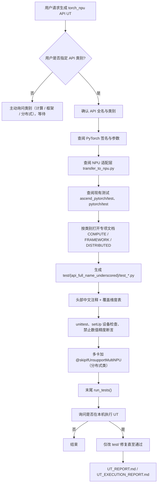

# pta-ut-generator（torch_npu / PTA API 功能 UT）

面向 **torch_npu（PTA）** 场景，用 Agent 技能规范生成与 **`ascend_pytorch/test` 风格一致**的 API 功能单元测试（**`unittest` + `TestCase`**）。本仓库以 **Cursor / Claude 技能定义**与 **`test/` 下示例 UT** 为主；可选通过子模块拉取 `pytorch`、`ascend_pytorch` 作签名与适配层对照。



## 项目概述

- **技能仓库**：在 Cursor（`.cursor/skills/`）与 Claude Code（`.claude/skills/`）中提供同名技能 **`gen-torch-npu-api-ut`**，规则以 Cursor 侧为主副本时，二者内容应对齐。
- **生成物**：仅允许新增或修改仓库根目录下 **`test/`** 内的 Python 与报告 Markdown；**不得**修改子模块内上游源码。
- **API 类别**（生成前必须由用户明确）：**计算类**、**框架类**、**分布式类**；对应专项说明见下表。

## 目录结构（与当前仓库一致）

```
.
├── .cursor/skills/gen-torch-npu-api-ut/
│   ├── SKILL.md                          # 主技能：流程、命名、禁忌、报告
│   └── references/
│       ├── COMPUTE_API_UT.md             # 计算类 API
│       ├── FRAMEWORK_API_UT.md           # 框架类 API
│       └── DISTRIBUTED_API_UT.md         # 分布式类 API
├── .claude/skills/gen-torch-npu-api-ut/  # Claude 侧同名技能（含上述专项 md 副本）
├── test/                                 # 示例与产出 UT（按 API 分子目录）
│   ├── UT_EXECUTION_REPORT.md            # 最近一次全量执行摘要（若有）
│   └── {api_full_name_underscored}/      # 各 API 独立目录
│       ├── test_*.py
│       └── UT_REPORT.md                  # 单 API 执行报告（可选）
├── ascend_pytorch/                       # git submodule（可选）
├── pytorch/                              # git submodule（可选）
└── README.md
```

## 子模块（参考源码）

| 路径 | 远程 | 用途 |
|------|------|------|
| `ascend_pytorch` | https://gitcode.com/Ascend/pytorch.git | NPU 适配、`transfer_to_npu`、测试风格范本 |
| `pytorch` | https://github.com/pytorch/pytorch.git | 官方 API 签名与测试参考 |

```bash
git submodule update --init --recursive
```

仅浏览 **`pytorch/torch`** 与 **`ascend_pytorch`** 主树（不编 ascend 全量）时，可只用非递归以节省时间：

```bash
git submodule update --init
```

### 子模块拉不下来时的常见原因

1. **父仓库从未登记子模块**：若历史提交里只有 `.gitmodules`，但 **没有** 把 `pytorch`、`ascend_pytorch` 以子模块记录（索引里应是 **模式 `160000` 的 gitlink**），则 `git submodule update --init` 不会克隆任何东西。需要在父仓库中执行 `git submodule add <url> <path>` 并提交、推送后再克隆。
2. **`.gitignore` 忽略了子模块路径**：例如存在 `pytorch/` 规则时，`git submodule add` 会失败（提示 *ignored by .gitignore*）。子模块目录**不应**被忽略。
3. **`--recursive` 很慢或部分第三方失败**：`ascend_pytorch` 内含多层 `third_party`，递归拉取体积大且依赖 gitcode/gitee 等网络。可改用上面的非递归 `update --init`；若仅需读 `transfer_to_npu` 与 PyTorch 签名，一般足够。

未初始化子模块时，仍可阅读本仓库 **`SKILL.md`** 与 **`test/`** 示例；生成前若需查签名，需在本地配置好对应源码路径或拉取子模块。

## 技能与参考文档

| 文档 | 说明 |
|------|------|
| [.cursor/skills/gen-torch-npu-api-ut/SKILL.md](.cursor/skills/gen-torch-npu-api-ut/SKILL.md) | 触发条件、命名规则、`setUp` 设备检查、禁止 pytest、报告要求、类别路由 |
| [references/COMPUTE_API_UT.md](.cursor/skills/gen-torch-npu-api-ut/references/COMPUTE_API_UT.md) | 计算类：shape/dtype/device、混合设备等 |
| [references/FRAMEWORK_API_UT.md](.cursor/skills/gen-torch-npu-api-ut/references/FRAMEWORK_API_UT.md) | 框架类：工具与硬件感知分支、日志等约束 |
| [references/DISTRIBUTED_API_UT.md](.cursor/skills/gen-torch-npu-api-ut/references/DISTRIBUTED_API_UT.md) | 分布式类：默认多卡 HCCL、`skipIfUnsupportMultiNPU` 等 |

## `test/` 中现有示例 UT（按目录）

以下为当前仓库内已存在的 UT 目录及 **`test_*` 方法数量**（与源码统计一致，便于对照 SKILL 中的命名规则）。

| 目录名 | 测试方法数 | 对应 API（逻辑名，示例） |
|--------|------------|-------------------------|
| `Work` | 2 | `torch.distributed.Work` |
| `Work_wait` | 3 | `torch.distributed.Work.wait` |
| `tensor_DTensor_local_tensor` | 2 | `torch.distributed.tensor.DTensor._local_tensor` |
| `tensor_dtensor_spec_TensorMeta` | 7 | `torch.distributed.tensor._dtensor_spec.TensorMeta` |
| `_composable_contract` | 5 | `torch.distributed._composable.contract` |
| `_composable_contract_get_registry` | 5 | `torch.distributed._composable.contract._get_registry` |
| `_composable_state_insert_module_state` | 5 | `torch.distributed._composable_state._insert_module_state` |
| `utils_get_root_modules` | 7 | `torch.distributed.utils._get_root_modules` |
| `device_mesh_get_device_handle` | 6 | `torch.distributed.device_mesh._get_device_handle` |
| `fsdp_common_utils_named_parameters_with_duplicates` | 7 | `torch.distributed.fsdp._common_utils._named_parameters_with_duplicates` |
| `cuda_Stream_wait_stream` | 6 | `torch.cuda.Stream.wait_stream` |
| `split_with_sizes_copy` | 18 | `torch.split_with_sizes_copy` |
| `tensor_copy_` | 18 | `torch.Tensor.copy_` |
| `_logging_warning_once` | 12 | `torch._logging.warning_once` |
| `_foreach_copy_` | 16 | `torch._foreach_copy_` |
| `autograd_graph__MultiHandle` | 23 | `torch.autograd.graph._MultiHandle` |

**合计**：16 组目录，**142** 个 `test_*` 方法。全量通过与否以你在 NPU 环境中的实际执行为准；历史一次全量摘要见 [test/UT_EXECUTION_REPORT.md](test/UT_EXECUTION_REPORT.md)（其中统计口径可能与当前代码行数不一致时，以本表与源码为准）。

## 命名与输出路径（摘要）

```
test/{api_full_name_underscored}/test_{api_full_name_underscored}.py
```

- 去掉 `torch.` 后，将剩余路径中的 `.` 换成 `_`，目录与文件名**不含点号**。
- 示例：`torch.distributed.Work` → 目录 `Work`；`torch.nn.functional.relu` → `nn_functional_relu`。

## 执行测试

技能要求使用 **`unittest`**，**禁止**在 UT 源码中使用 pytest API。运行方式示例：

**单个目录（示例：`Work`）**

```bash
cd test/Work
python test_distributed_Work.py
# 或
python -m unittest test_distributed_Work.TestDistributedWork -v
```

**全量执行**：各 API 在独立子目录中，且子目录下通常**无** `__init__.py`，`unittest discover` 不会从 `test/` 根目录一次性递归到所有子文件夹。可在仓库根目录对**每个子目录**分别发现，例如：

```bash
# 示例：只跑 Work 目录
python -m unittest discover -s test/Work -p "test_*.py" -v
```

在 **PowerShell** 中遍历所有子目录（每个目录一个 `test_*.py`）：

```powershell
Set-Location <仓库根目录>
Get-ChildItem -Path test -Directory | ForEach-Object {
  python -m unittest discover -s $_.FullName -p "test_*.py" -v
}
```

或直接逐个执行各目录下的 `python test_xxx.py`（文件末尾一般为 `run_tests()`）。

**环境**：需已安装并可使用 **`torch_npu`**；多卡用例需满足对应用例中 `@skipIfUnsupportMultiNPU(n)` 的 NPU 数量。

## 测试报告

执行完成后，按 SKILL 要求在 Markdown 中记录命令、环境、PASS/FAIL/SKIP、跳过原因等：

| 场景 | 路径 |
|------|------|
| 单个 API | `test/{api_full_name_underscored}/UT_REPORT.md` |
| 全量或总表 | `test/UT_EXECUTION_REPORT.md` |

## 贡献约定

- **仅修改 `test/`**（及本仓库说明类文档如 README）；子模块 **`pytorch/`、`ascend_pytorch/`** 保持上游内容，不在本仓库直接改上游实现。
- 用例设计：参数与类型覆盖、混合设备、可稳定断言的异常路径；**不做**逐元素浮点精度验收。

## License

与上游 PyTorch / 昇腾适配栈的许可保持一致；以各子模块及依赖包声明为准。
